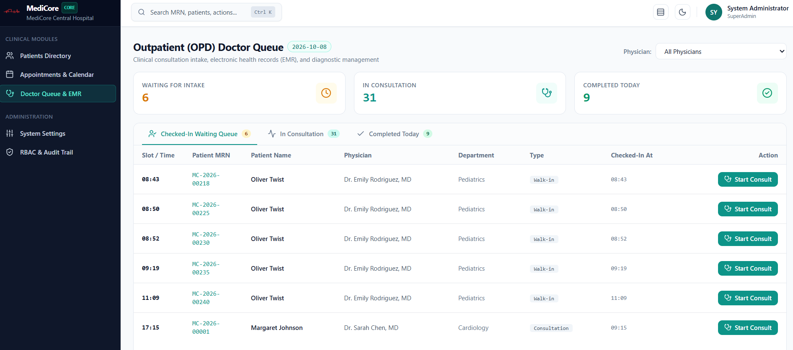
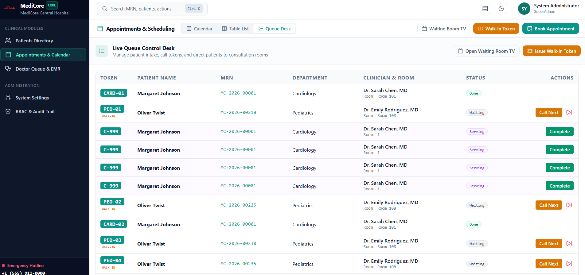
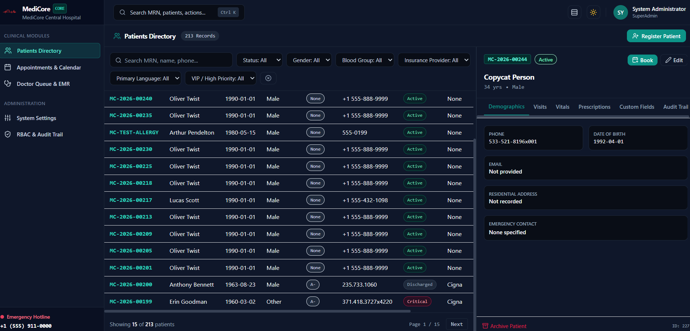

<p align="center">
  
</p>

<h1 align="center">MediCore</h1>

<p align="center">
  <strong>Next-Generation Modular Hospital Information System (HIS) & Electronic Medical Records (EMR)</strong><br>
  Desktop-dense clinical workflows • Plugin-based modular monolith • Event-driven domain architecture
</p>

<p align="center">
  <a href="#-architecture--key-innovations"></a>
  <a href="https://www.python.org/downloads/"></a>
  <a href="https://fastapi.tiangolo.com/"></a>
  <a href="https://sqlmodel.tiangolo.com/"></a>
  <a href="https://htmx.org/"></a>
  <a href="https://alpinejs.dev/"></a>
  <a href="https://www.docker.com/"></a>
  <a href="#-testing--verification"></a>
  <a href="LICENSE"></a>
</p>

<p align="center">
  
</p>

---

## 📋 Overview

**MediCore** is a high-performance, modular monolith Hospital Information System (HIS) and Electronic Medical Record (EMR) built for modern healthcare facilities. It pairs desktop-dense, keyboard-friendly clinical interfaces with high development velocity, dynamic schema-driven views, and strict security and domain isolation.

Designed with **FastAPI**, **SQLModel**, **Alembic**, **Jinja2**, **HTMX**, and **Alpine.js**, MediCore operates with zero heavy client-side build steps while providing lightning-fast, reactive SPA-like responsiveness.

---

## 📸 Interface Showcase

<table width="100%">
  <tr>
    <td align="center">
      <strong>🩺 Outpatient (OPD) Doctor Queue & EMR</strong><br><br>
      <br>
      <em>Real-time intake queue, live status counters (Waiting, In Consultation, Completed), and 1-click consultation initiation.</em>
    </td>
  </tr>
  <tr>
    <td align="center">
      <strong>📅 Appointments & Live Queue Control Desk</strong><br><br>
      <br>
      <em>Departmental token calling (<code>PED-01</code>, <code>CARD-01</code>), waiting room TV synchronization, and intake management.</em>
    </td>
  </tr>
  <tr>
    <td align="center">
      <strong>👥 Patients Directory & Patient 360 (Dark Mode)</strong><br><br>
      <br>
      <em>High-density master-detail split pane, multi-field clinical filtering, and Patient 360 history tabs in dark theme.</em>
    </td>
  </tr>
</table>

---

## 🏥 Architecture & Key Innovations

### 1. Plugin-Based Modular Monolith
Each clinical department lives as an autonomous, self-contained package under `medicore/modules/` (e.g., `patients`, `appointments`, `consultations`). The core engine auto-discovers module manifests, database models, API routers, navigation tabs, permissions, command-palette actions, and background jobs upon application boot.

### 2. Zero Cross-Module Direct Imports
Modules never import each other directly. All inter-module communication occurs via asynchronous domain events on the centralized `EventBus` (`event_bus.emit(...)`, `event_bus.subscribe(...)`). For instance, completing an encounter emits `encounter.completed` for billing and pharmacy to react without tight coupling.

### 3. Metadata-Driven UI Engine
Clinical entities are defined as an `EntitySchema` (fields, validations, badges, list columns, filters). Generic Jinja2 + HTMX renderers dynamically generate:
- High-density data tables with multi-field search and status badges
- Real-time filter toolbars
- Split-pane slide-over detail drawers
- Modal creation/editing forms with validation feedback

### 4. Runtime Custom Fields
System administrators can attach custom fields to any entity at runtime (e.g., insurance policy ID, emergency contacts). Stored in schema-less JSON columns, these fields automatically appear in forms, tables, and detail panes without modifying database schemas or running migrations.

### 5. Granular Dynamic RBAC & Audit Trail
Permissions follow the hierarchical `module.entity.action` standard (e.g., `consultations.encounter.write`, `patients.patient.read`). Roles and permissions reside in the database and are enforced across API endpoints, templates, and field-level visibility. An immutable audit trail records all clinical data creation, updates, and accesses with timestamps and user identifiers.

### 6. Design Tokens & Adaptive Theming
Built on CSS variable design tokens (`tokens.css`). Supports **Light** and **Dark** modes as well as **Compact** (desktop-dense) and **Comfortable** table display densities, customizable per user.

---

## 📦 Implemented Clinical Modules

### 🩺 1. OPD Consultations & EMR (`medicore.modules.consultations`)

<p align="center">
  
</p>

- **Active Doctor Queue**: Launch consultations directly from checked-in appointments. Automatically shifts status to `In-Consultation` and initiates clinical encounters.
- **Three-Pane Clinical Workspace**:
  1. *Left Pane*: Patient 360 timeline, previous encounters, active allergy flags, and vitals trend sparklines.
  2. *Center Pane*: SOAP note editor with specialty templates (`General`, `Cardiology`, `Pediatrics`), quick text macro expansion (`.htn`, `.dm2`, `.copd`, `.asthma`), drafts autosave, and cryptographic note signing.
  3. *Right Pane*: Orders (Lab & Imaging), ICD-10 diagnoses search, and e-Prescription composer.
- **Vitals Calculation & Sparklines**: Real-time BMI and BSA (Mosteller) auto-computation, out-of-range clinical highlighting (e.g., hypertensive alerts, tachycardia), and trend sparklines across historical visits.
- **Immutable Notes & Addenda**: Signed notes are locked and immutable. Subsequent corrections are appended as audited addenda with physician timestamp and rationale.
- **ICD-10 Diagnostic Search**: Comprehensive ICD-10 clinical dataset with instant autocomplete, primary/secondary diagnosis classification, and clinician favorites.
- **E-Prescribing & Dosage Calculator**: Search by generic or brand name, automatic quantity estimation based on dose, frequency (e.g., `TID`, `QID`, `PRN`), duration, and route. Supports 1-click "Repeat Last Prescription".
- **Pluggable Clinical Safety Rules Engine**:
  - Drug-Allergy cross-checks (e.g., Penicillin allergy vs. Amoxicillin).
  - Duplicate therapy detection.
  - Drug-Drug Interaction (DDI) severity analysis (Major, Moderate, Minor) with bundled interaction datasets.
  - Hard clinical stops requiring physician override reason and audit logging.
- **Lab & Radiology Orders**: Priority ordering (`Routine`, `Urgent`, `STAT`) emitting `order.placed` domain events.
- **Printable & PDF Visit Summaries**: Standardized clinical summary document with hospital branding, physician signature lines, and one-click PDF generation via ReportLab.
- **Patient 360 Clinical Tabs**: Deeply wired **Visits**, **Vitals History**, and **Prescriptions History** tabs directly inside the patient profile.

---

### 📅 2. Appointments & Scheduling (`medicore.modules.appointments`)

<p align="center">
  
</p>

- **Doctor Schedules**: Weekly working templates, custom exceptions, slot durations, and clinician leave days.
- **Day & Week Calendar**: Drag-and-drop interactive calendar with Day view (hourly slots) and Week view (multi-clinician grid), color-coded by clinical status.
- **Concurrency & Double-Booking Guard**: Database-level unique constraint (`uq_appointment_doctor_time`) plus application-level conflict validation preventing overlapping bookings.
- **Walk-in Intake & Live Tokens**: Express intake issuing sequential departmental tokens (e.g., `CARD-01`, `PED-02`, `GEN-03`).
- **Waiting Room TV Monitor Display**: Full-screen outpatient TV screen at `/appointments/display` with 5-second HTMX auto-refresh, audio cues, and privacy-compliant display (Token + First Name only).
- **Status Lifecycle Flow**: `Booked` ➔ `Checked-in` ➔ `In-Consultation` ➔ `Completed` / `Cancelled` / `No-show`.
- **Automated Reminders**: Background APScheduler job scanning 24–48h upcoming bookings.
- **Wait-Time & No-Show Analytics**: Real-time dashboard widget tracking average wait times and attendance rates.

---

### 👥 3. Patients Directory (`medicore.modules.patients`)

<p align="center">
  
</p>

- **Master-Detail Split-Pane**: Dense patient list with quick-filter toolbar and slide-out patient summary.
- **Server-Enforced Duplicate Detection**: Multi-field matching on save (phone, full name, date of birth) with audible warning, override justification requirements, and audit logging.
- **Sequential MRN Generator**: Automatic generation of hospital medical record numbers (`MC-YYYY-NNNNN`).
- **Allergy & Medical Alert Badges**: Critical allergy banners visible at all stages of care.
- **Full Theme & Density Support**: Seamless Light/Dark theme switching and Compact/Comfortable density settings.

---

### 💊 4. Pharmacy & Dispensing (`medicore.modules.pharmacy`)

- **Event-Driven Dispensing Queue**: Automatically populated from signed clinical prescriptions via `prescription.signed` domain events. Track statuses from `Pending` ➔ `In-Progress` ➔ `Dispensed` / `Partial` / `Rejected`.
- **Safety-First Clinical Dispense Screen**: Inspect full prescription details, active patient allergy banners, and prescriber drug-interaction override justifications.
- **Automated FEFO Batch Picking**: Automatically suggests earliest-expiring active batches (First-Expiry-First-Out) with hard blocking of expired or quarantined batches.
- **Partial Dispensing & Generic Substitution**: Full support for dispensing partial quantities and generic medication substitutions with mandatory logged clinical justification.
- **Immutable Stock Ledger (`StockMovement`)**: Complete auditability where every physical stock movement (receipts, dispenses, returns, adjustments, transfers, wastage, quarantine locks) is recorded with immutable reason codes. Current balances are derived without direct quantity overwrites.
- **Real-Time Inventory Alerts & Quarantine**: Live tracking of low stock levels (below reorder threshold), near-expiry risk (<60 days), and 1-click batch quarantine with reason logging.
- **Purchasing & Goods Receipt (GRN)**: Automated reorder suggestions based on actual consumption, purchase order lifecycle (`draft` ➔ `ordered` ➔ `partial_received` ➔ `received`), and goods receipts with lot and expiry tracking.
- **Over-the-Counter (OTC) POS Terminal**: Walk-in counter sales without prescription, barcode/SKU auto-search, cash/card handling, and immediate stock ledger deduction.
- **Multi-Store & Sub-Store Transfers**: Multi-location support (Central Main Pharmacy, Inpatient Ward Sub-Store, Operating Theater Satellite, Emergency Trauma Sub-Store) with structured inter-store transfer requests and approvals.
- **Returns with Dual Authorization**: Patient medication returns and supplier returns with approval workflows and ledger reversals.
- **Comprehensive Analytical CSV Reports**: On-demand stock valuation, near-expiry risk, immutable movement ledger, and top-consumed medications with 1-click CSV download.

---

### 🔬 5. Clinical Laboratory Management (LIS) (`medicore.modules.laboratory`)

- **Diagnostic Worklist**: Centralized requisition dashboard auto-provisioned from `order.placed` clinical orders or walk-ins. Filter dynamically by Priority (`STAT`, `Urgent`, `Routine`), Department, Status, or breached TAT deadlines.
- **Specimen Flow Lifecycle**: Automated barcode labeling (`SPEC-YYYY-XXXXX`), phlebotomy collection, lab receiving, and rejection handling (hemolyzed, clotted, insufficient volume) with automatic recollection requests.
- **Result Entry Grid**: Analyte grids per test and panel (e.g. CBC, LFT, KFT, Lipid Panel, Urinalysis, Cardiac Markers) with automatic high/low/critical flagging against age- and sex-stratified biological reference intervals.
- **Calculated Analytes Engine**: Automatic calculation of derived parameters without manual math (A/G Ratio, Globulin, Indirect Bilirubin, Friedewald VLDL/LDL, BUN/Creatinine Ratio).
- **Previous-Result Delta Trend**: Inline comparison against prior approved patient results with dates to identify clinical acute variations.
- **Two-Step Approval & Immutability**: Medical laboratory technologists enter results (`laboratory.result.enter`); Consultant Pathologists authorize and sign off reports (`laboratory.result.approve`). Approved diagnostic reports are strictly immutable.
- **Report Amendments**: Pathologist amendments bump the version (v1 ➔ v2), mark the report as a prominent `CORRECTED REPORT`, record the clinical amendment reason, and audit all changes.
- **Life-Threatening Critical Values**: Prominently highlighted critical flags with ordering physician telephone acknowledgement logging (doctor name, timestamp, and clinical action notes). Emits `result.critical` domain events.
- **Automated Analyzer CSV Ingestion**: Batch upload or copy-paste analyzer outputs (`barcode,parameter_code,value`) from Sysmex, Roche Cobas, Beckman, and Mindray systems with automated range evaluation.
- **Branded Diagnostic Lab Report PDF**: Professional PDF generation using ReportLab featuring hospital branding, patient demographic header, comprehensive results table, corrected-report notices, physician acknowledgements, and pathologist signatures.
- **Patient 360 Integration**: Dedicated `Labs` tab within the Patient 360 workspace providing repeat test trend cards and complete investigation history.

---

## 🚀 Quickstart Guide

### Option A: Running with Docker (Recommended)

MediCore includes a production-ready `Dockerfile` and `docker-compose.yml`:

```bash
# Clone the repository
git clone https://github.com/yaratul2005/MEDICORE.git
cd MEDICORE

# Build and start container (runs migrations and starts uvicorn)
docker compose up --build
```
Open [http://localhost:8000](http://localhost:8000) in your browser.

---

### Option B: Local Setup with Python

#### 1. Prerequisites
- Python 3.12 or 3.13
- [`uv`](https://github.com/astral-sh/uv) (recommended) or standard `pip`

#### 2. Virtual Environment & Installation
```bash
# Create virtual environment
uv venv .venv

# Activate environment
# On Windows:
.venv\Scripts\activate
# On Linux/macOS:
source .venv/bin/activate

# Install dependencies
uv pip install -e .[dev]
```

#### 3. Database Migrations
Apply Alembic migrations to construct the database schema:
```bash
alembic upgrade head
```

#### 4. Seed Clinical Data
Populate realistic hospital data (200 patients, 5 doctors across 5 departments, 100 appointments, 150 clinical encounters with SOAP notes, vitals, prescriptions, ICD-10 reference data, 300 pharmacy items, 403 batches, 514 stock movements, 80 dispenses, 69 lab tests with 182 parameters, 200 lab orders, and default RBAC roles):
```bash
python -m medicore.seed.seeder
```

#### 5. Launch the Application
```bash
uvicorn main:app --host 127.0.0.1 --port 8000 --reload
```

---

## 🧪 Testing & Verification

MediCore includes a comprehensive test suite covering core infrastructure, scheduling concurrency, duplicate patient prevention, clinical safety rules, encounter lifecycles, pharmacy FEFO & stock ledgers, and laboratory diagnostic workflows:

```bash
uv run --extra dev pytest -v
```

```text
============================= test session starts =============================
medicore/tests/test_appointments.py::test_doctor_slot_generation PASSED        [ 1%]
medicore/tests/test_appointments.py::test_booking_conflict_detection PASSED   [ 3%]
medicore/tests/test_appointments.py::test_status_transitions_and_events PASSED[ 5%]
medicore/tests/test_appointments.py::test_walkin_registration_and_queue_token PASSED [ 7%]
medicore/tests/test_appointments.py::test_waiting_room_display_endpoints PASSED [ 9%]
medicore/tests/test_appointments.py::test_reschedule_with_conflict_guard PASSED [11%]
medicore/tests/test_appointments.py::test_appointment_reminders_and_stats PASSED [13%]
medicore/tests/test_appointments.py::test_concurrent_double_booking_protection PASSED [15%]
medicore/tests/test_consultations.py::test_vitals_math_and_clinical_warnings PASSED [17%]
medicore/tests/test_consultations.py::test_soap_text_shortcuts_expansion PASSED [19%]
medicore/tests/test_consultations.py::test_quantity_calculation_from_frequency PASSED [21%]
medicore/tests/test_consultations.py::test_icd10_and_drug_search PASSED    [23%]
medicore/tests/test_consultations.py::test_pluggable_safety_rules_engine PASSED [25%]
medicore/tests/test_consultations.py::test_start_consultation_lifecycle PASSED [27%]
medicore/tests/test_consultations.py::test_soap_note_autosave_signing_and_addenda PASSED [29%]
medicore/tests/test_consultations.py::test_prescription_safety_warning_and_override_enforcement PASSED [31%]
medicore/tests/test_consultations.py::test_order_placement_and_event_emission PASSED [33%]
medicore/tests/test_consultations.py::test_encounter_completion_and_billing_event PASSED [35%]
medicore/tests/test_consultations.py::test_pdf_visit_summary_generation PASSED [37%]
medicore/tests/test_consultations.py::test_patient_360_clinical_tabs_wired PASSED [39%]
medicore/tests/test_core.py::test_config_profiles PASSED                   [41%]
medicore/tests/test_core.py::test_password_hashing PASSED                  [43%]
medicore/tests/test_core.py::test_event_bus PASSED                         [45%]
medicore/tests/test_core.py::test_settings_registry PASSED                 [47%]
medicore/tests/test_core.py::test_module_registry PASSED                   [ 49%]
medicore/tests/test_laboratory.py::test_tat_deadline_and_breach_detection PASSED [ 50%]
medicore/tests/test_laboratory.py::test_specimen_flow_lifecycle PASSED   [ 52%]
medicore/tests/test_laboratory.py::test_reference_range_evaluation PASSED [ 54%]
medicore/tests/test_laboratory.py::test_calculated_parameters_engine PASSED [ 56%]
medicore/tests/test_laboratory.py::test_two_step_workflow_and_amendments PASSED [ 58%]
medicore/tests/test_laboratory.py::test_critical_value_and_acknowledgement PASSED [ 60%]
medicore/tests/test_laboratory.py::test_instrument_csv_import PASSED     [ 62%]
medicore/tests/test_laboratory.py::test_order_placed_event_subscription PASSED [ 64%]
medicore/tests/test_laboratory.py::test_lab_report_pdf_generation PASSED [ 66%]
medicore/tests/test_patients.py::test_patients_index_page PASSED         [ 68%]
medicore/tests/test_patients.py::test_patients_table_partial PASSED      [ 70%]
medicore/tests/test_patients.py::test_patient_detail_pane PASSED         [ 72%]
medicore/tests/test_patients.py::test_duplicate_patient_detection PASSED [ 74%]
medicore/tests/test_patients.py::test_create_patient_and_audit_event PASSED [ 76%]
medicore/tests/test_patients.py::test_server_enforced_duplicate_prevention_and_override PASSED [ 78%]
medicore/tests/test_pharmacy.py::test_fefo_batch_picking_and_expired_blocking PASSED [80%]
medicore/tests/test_pharmacy.py::test_immutable_stock_movement_ledger PASSED [82%]
medicore/tests/test_pharmacy.py::test_low_stock_and_expiry_alerts_and_quarantine PASSED [84%]
medicore/tests/test_pharmacy.py::test_prescription_signed_event_creates_dispense_queue PASSED [86%]
medicore/tests/test_pharmacy.py::test_dispense_order_completion_and_domain_event PASSED [88%]
medicore/tests/test_pharmacy.py::test_partial_dispensing_and_generic_substitution PASSED [90%]
medicore/tests/test_pharmacy.py::test_counter_otc_sales_flow PASSED        [92%]
medicore/tests/test_pharmacy.py::test_multi_store_transfers PASSED         [94%]
medicore/tests/test_pharmacy.py::test_pharmacy_returns_approval_workflow PASSED [96%]
medicore/tests/test_pharmacy.py::test_reports_csv_exports PASSED           [98%]
medicore/tests/test_pharmacy.py::test_pharmacy_ui_and_widget_endpoints PASSED [100%]
============================== 51 passed in 41.52s ==============================
```

---

## 🌐 Application Navigation & Endpoints

| Endpoint | Description |
| :--- | :--- |
| **`/consultations`** | Active OPD doctor consultation queue, in-progress encounters, clinical stats |
| **`/consultations/encounter/{id}`** | Three-pane OPD clinical workspace (Timeline, SOAP note, Orders & Rx) |
| **`/consultations/encounter/{id}/summary`**| Printable branded clinical visit summary & Rx |
| **`/consultations/encounter/{id}/pdf`** | Downloadable clinical visit summary PDF with hospital header & branding |
| **`/appointments`** | Day/Week calendar, appointments table, queue management desk |
| **`/appointments/display`** | Full-screen waiting room TV display with live 5s auto-refresh |
| **`/patients`** | Master patient directory, Patient 360 (Visits, Vitals, Prescriptions, Labs) |
| **`/laboratory`** | Diagnostic worklist, STAT/Urgent priority filters, TAT breach monitoring |
| **`/laboratory/order/{id}/results`** | Analyte result entry grid, automated reference flags, delta trends, calculated parameters |
| **`/laboratory/order/{id}/report`** | Diagnostic laboratory report view with pathologist verification & amendments |
| **`/laboratory/order/{id}/pdf`** | Downloadable branded lab report PDF with pathologist electronic signature |
| **`/laboratory/catalog`** | Laboratory test catalog directory, turnaround times, and departmental test panels |
| **`/laboratory/catalog/{id}`** | Test parameter editor, LOINC code configuration, and age/sex reference intervals |
| **`/laboratory/import`** | Automated clinical analyzer CSV import terminal (Sysmex, Cobas, Mindray) |
| **`/pharmacy`** | Prescription dispensing queue, quick stats, inventory alert widgets |
| **`/pharmacy/dispense/{id}`** | Safety-first clinical dispense workspace (FEFO batch picking, allergy banner, overrides) |
| **`/pharmacy/otc`** | Rapid Over-the-Counter POS terminal for counter medication sales |
| **`/pharmacy/inventory`** | Multi-store inventory balances, batch lots, and immutable movement ledger |
| **`/pharmacy/purchasing`** | Purchase order management, reorder suggestions, and goods receipts (GRN) |
| **`/pharmacy/transfers`** | Multi-store stock transfer requests and authorization workflow |
| **`/pharmacy/returns`** | Patient and supplier medication returns with pharmacist approval |
| **`/pharmacy/reports`** | Valuation, near-expiry risk, stock ledger, and top-consumed drugs + CSV exports |
| **`/settings`** | System settings, hospital profile, departments, MRN prefixes |
| **`/audit`** | Comprehensive clinical and administrative audit trail |

---

## 🔑 Default User Accounts

| Username | Password | Role | Description |
| :--- | :--- | :--- | :--- |
| `admin` | `admin123` | **SuperAdmin** | Full system administration, RBAC, system settings, audit logs |
| `dr.sarah` | `doctor123` | **Doctor** | Clinical OPD encounters, SOAP notes, e-prescribing, order placement |
| `nurse.john` | `nurse123` | **Nurse** | Vitals recording, triage assessment, waiting room queue control |
| `receptionist.mary` | `reception123` | **Receptionist** | Front-desk intake, appointment scheduling, walk-in tokens |
| `tech.alex` | `lab123` | **LabTechnician** | Diagnostic worklist, specimen collection, result entry, analyzer CSV import |
| `pathologist.victor` | `path123` | **Pathologist** | Result review, two-step authorization, clinical amendments, critical ack |
| `pharmacist.lisa` | `pharmacy123` | **Pharmacist** | Prescription dispensing, FEFO picking, generic substitutions, OTC sales |
| `storekeeper.dan` | `store123` | **StoreKeeper** | Stock movements, warehouse purchases, goods receipt, inter-store transfers |

---

## 🛠️ Adding New Modules

To add a new clinical or administrative module (e.g., `billing`, `radiology`, `inpatient`) in 5 easy steps without modifying core source code, refer to [ARCHITECTURE.md](ARCHITECTURE.md).

---

## 📄 License
This project is licensed under the [MIT License](LICENSE).
